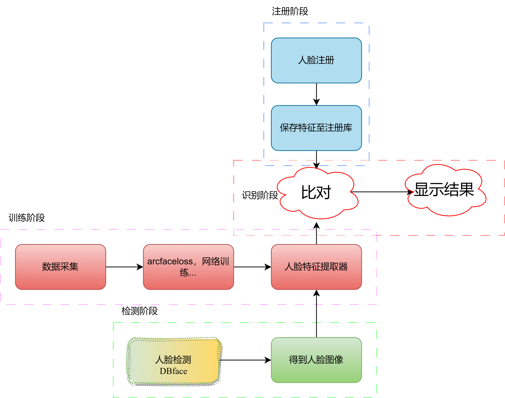
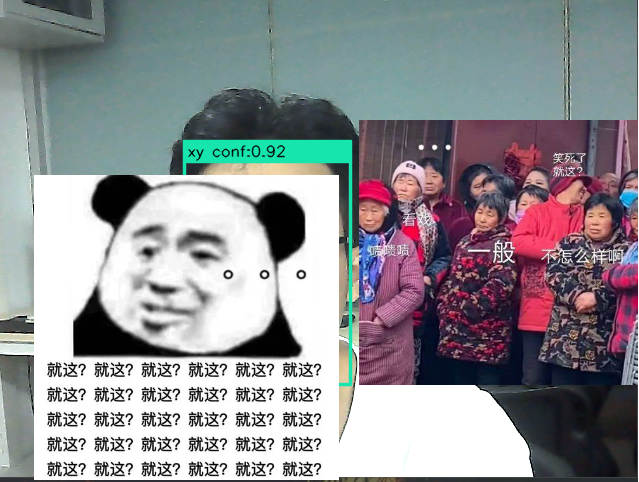

<a align="left">
  <a href [https://github.com/XianYang2547]">
  </a>


## <p align="center">小型人脸识别🚀🚀🚀</p> 
## 项目介绍
1. 在DBface检测的基础上，解析模型输出结果，得到人脸区域信息，对其进行处理并截取保存；
2. 搭建主干网络，训练脚本，完成人脸特征提取、录入与保存；
3. 编写程序调用接口实现模型加载、识别等。

## 环境依赖
见requirements.txt
## 目录结构
```
.
├─crop_result                视频人脸录入保存图像
│  ├─xy
│  └─zl
├─datas                      //数据存放
│  │  calculate_mean_std.py  //1. 计算mean std
│  │  get_data.py            //2. 划分训练验证数据
│  │  train.txt
│  │  val.txt
│  │  Obtain_face_image.py   //自己通过摄像头获取人脸数据
│  └─train_val               // 数据存放
│  │    ├─bj
│  │    ├─ch
│  │    └─ckj
│  └─crop_result             //存放获取的数据
├─logs                       //训练验证曲线记录
├─my_loss                    //损失函数
│  │  arc_loss.py
│  │  center_loss.py
│  │  test.py
│  │  
│  └─data_and_result
│          result.jpg       
├─utils                      //修改的dbface工具类
│      common.py
│      DBFace.py
│      db_pro.py 
└─weight                     //权重存放
│          best.pt
│          dbface.pth
│  face_video.py             //录入和识别
│  my_train.py               //训练
│  test.ipynb                //测试脚本
```
## 项目流程

<p align="center"> 

</p>

## 使用说明
1. 数据制作：可使用Obtain_face_image.py进行人脸检测，将检测到的人脸区域图像进行保存.具体的：将detect返回的objs解析，根据长宽进行处理得到最佳人脸区域，见utils/common.py中crop_face(),若截取图像不好的话可将ab互换.
2. 数据储存：-->datas/train_val中，datas/calculate_mean_std.py计算数据的mean和std，datas/get_data.py中的shufff()用来进行数据划分，生成train.txt和val.txt.
3. 网络训练：在my_train.py中，使用densenet121()和Arc_face_loss()进行训练.train_face()为常规迭代，训练验证保存打印等...[我的data和model](https://pan.baidu.com/s/1cRG8CD7x40nNI75_YRkeUQ?pwd=2547)
4. 人脸注册：face_video.py中的Face_Entry()函数，调用DBface进行人脸检测，（保存通过objs中的信息来制定需要保存的人脸，并将其保存. 采集脸部100张数据，）加载训练好的网络特征提取模型，进行特征提取以及保存为pt文件，test.ipynb中有方法来查看它.
5. 开始识别：执行face_video.py中的camera_demo()函数，在cv2打开的视频窗口中进行识别，显示人脸框、名字、置信度.
6. 结果：
- [x] 自己
<p align="center"> 

</p>

- [ ] 旁边工位的人

## Reference
- [https://github.com/dlunion/DBFace](https://github.com/dlunion/DBFace)
- [https://github.com/liuzhuang13/DenseNet](https://github.com/liuzhuang13/DenseNet)
## 
~有个好师傅real nice，不遗余力的教我。常布置一些任务让我完成，也学到了好多东西，比如代码知识，流程架构等等~</p>
~抽了点时间，断断续续的将之前的东西重新构建了一遍，以便于更好的保存~


